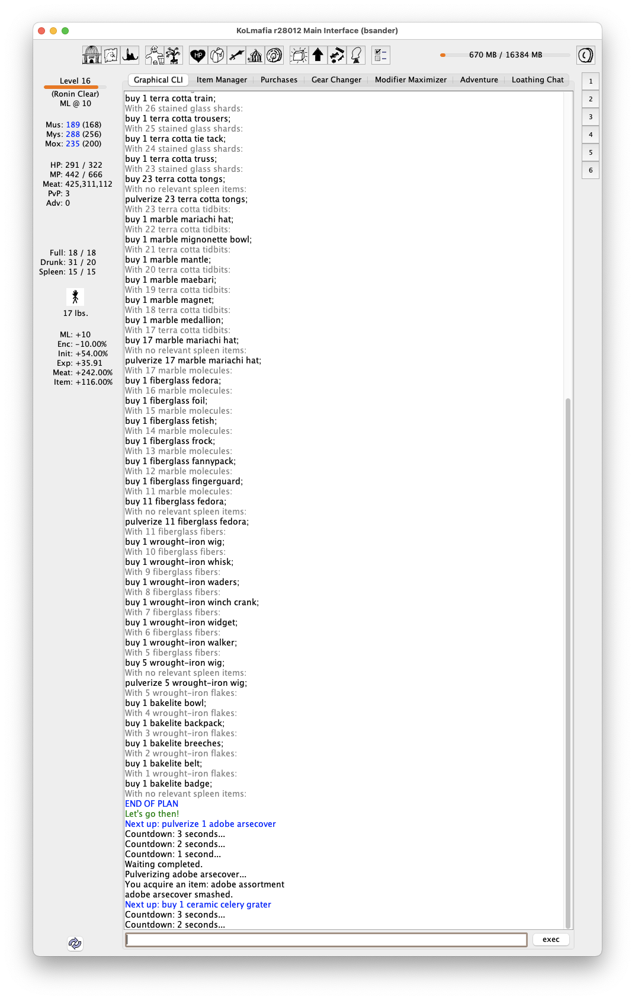

# Thriftshop

Trade in your hand-me-downs for some vintage gear!

## Installation

```
git checkout SaneBread/thriftshop release
```

## Things to do

### Browse the Racks

```
thriftshop look
```

Will present an overview of all the known standard outfits, the pieces of it you own, how many more are needed for the full set, and how many can be pulverized to acquire previous years' outfits


### Make a Shopping List

```
thriftshop list
```

Will present a step-by-step list of actions to perform to maximize the number of previous years' outfits.

It will only consider gear and spleen items for use when they live directly in your inventory. Closeted, Hagnked, Display Cased or Equipped gear will not be considered for trade!


### Go Shopping

```
thriftshop shop
```

Will execute the aforementioned plan, and let you walk out the shop with some cool retro outfits!

It will check at every step if the number of spleen items in inventory match its expectations, and abort when that fails.



---

## Todo list

- [ ] consider possible 1-handed vs 2-handed weapons and obey mafia prefs for
      slots
- [ ] proper arg handling
- [x] write readme
